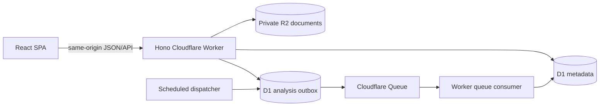
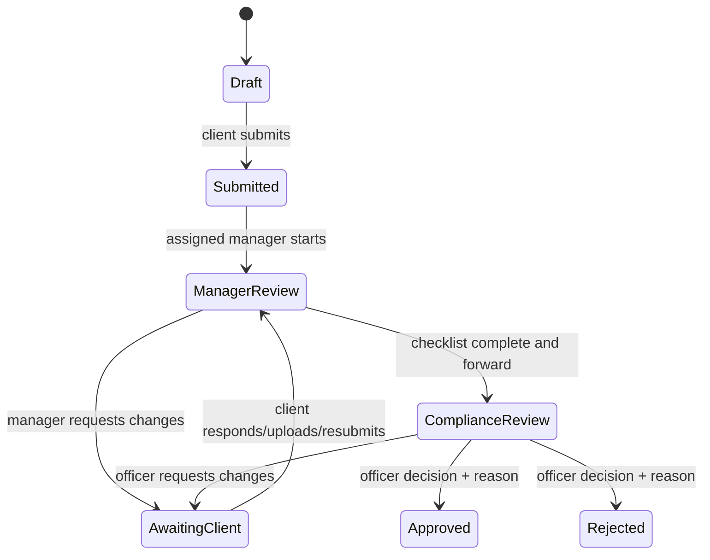

# Digital Compliance Hub — LLM Project Context

Last verified: 2026-09-29

This file is the compact source of truth for an LLM or developer entering the repository. Read it before changing code. Detailed phase documents remain under `docs/`, but some older historical wording may describe earlier plans rather than the current runtime.

## 1. Project purpose

Digital Compliance Hub is a synthetic-data proof of concept for a bank document-review workflow. A corporate client creates a case and uploads a contract/invoice package. A bank manager performs formal checks. A compliance officer reviews deterministic simulated analysis, requests corrections, and approves or rejects the package. The client can upload a corrected version and resubmit.

This POC demonstrates workflow, permissions, document versioning, audit history, operational statistics, asynchronous processing, and Cloudflare deployment. It does **not** execute a payment, trade, FX operation, sanctions decision, or legally binding compliance determination.

The application targets prospective banking customers in Ukraine and the EU/EEA, but it contains no validated jurisdiction-specific rule pack.

## 2. Current deployment and scope

- Hosted URL: `https://dch.cooptinyteam.org`
- Hosting: Cloudflare Worker with static assets.
- Database: Cloudflare D1, EU jurisdiction.
- Documents: private Cloudflare R2 bucket, EU jurisdiction.
- Processing: Cloudflare Queue plus a five-minute scheduled outbox dispatcher.
- Local URL: `http://127.0.0.1:5178`
- Authentication mode: public fictional-account picker in both environments.
- Data classification: synthetic demo data only.
- Cloudflare Access, MFA, production SSO, and real identity verification are intentionally excluded from Phases 1–7.

Anyone with the hosted URL can choose any fictional account. Server-side role and organization authorization still applies after account selection, but the picker is not production authentication. Never put real customer, bank, identity, payment, or confidential documents into this deployment.

## 3. Technology stack

| Layer               | Technology                                     |
| ------------------- | ---------------------------------------------- |
| UI                  | React 19, TypeScript, Vite                     |
| API                 | Hono running in Cloudflare Workers             |
| Metadata            | D1/SQLite with explicit SQL migrations         |
| Files               | Private R2 objects                             |
| Background work     | Cloudflare Queues, scheduled outbox dispatch   |
| Tests               | Node test runner and in-memory SQLite adapters |
| Package manager     | pnpm 11.4.0                                    |
| Development runtime | Node.js 24                                     |
| Deployment          | Wrangler 4                                     |

Important directories:

```text
src/web/                  React interface and translations
src/api/                  Hono routes and business operations
src/adapters/cloudflare/  Worker and fictional-session adapters
src/domain/               shared domain types
src/contracts/            API/session contracts
migrations/               ordered D1 schema migrations
fixtures/documents/       allowed synthetic PDF bytes
scripts/                  build, deploy, smoke, seed, backup and recovery tools
tests/                    API, workflow, analysis and recovery verification
docs/                     phase plans, walkthrough and release runbooks
```

## 4. Runtime architecture



The same Worker serves the SPA and API. Local development uses Cloudflare's Vite integration and local D1/R2 bindings. The domain/API code depends on structural `Database` and `ObjectStore` interfaces so tests can use SQLite and in-memory objects.

## 5. Roles and authorization

### Fictional accounts

| Role               | Local ID           | Hosted ID               | Scope                     |
| ------------------ | ------------------ | ----------------------- | ------------------------- |
| Northstar client   | `client-northstar` | `demo-client-northstar` | `org-northstar`           |
| Cedar client       | `client-cedar`     | `demo-client-cedar`     | `org-cedar`               |
| Manager            | `manager`          | `demo-manager`          | assigned to Northstar (local also Cedar) |
| Compliance         | `compliance`       | `demo-compliance`       | assigned to Northstar (local also Cedar) |
| Demo administrator | `admin`            | `demo-admin`            | administration shell only |

Authorization rules:

- Clients have exactly one organization membership.
- Staff memberships are bank-level, but case access additionally requires an explicit `staff_assignments` row for the case organization.
- A client can never select another organization through a request parameter.
- Cedar must never see Northstar cases, statistics, notifications, messages, analysis, or documents.
- Internal messages are omitted from client API responses.
- `demo-admin` cannot access business cases or dashboards.
- Assigned managers can execute manager commands.
- Assigned compliance officers can execute compliance commands and final decisions.
- Hidden UI controls are not the security boundary; every API route enforces authorization.

### Sessions

- The fictional picker creates a random 32-byte token.
- Only its SHA-256 hash is stored in `local_sessions`.
- Sessions expire after 30 minutes.
- Cookies are HttpOnly and SameSite=Strict; hosted HTTPS cookies are Secure.
- Logout removes the stored session and expires the cookie.
- Mutations require a matching origin and `X-CSRF-Protection: 1`.
- Cross-origin mutations are rejected.

An unused optional Access adapter remains in the code for possible future work. It is not part of current acceptance and must not be treated as configured protection.

## 6. Case workflow



Rules and edge cases:

- A first submission requires at least one accepted document version.
- Submitting an already `Submitted` or `ManagerReview` case is idempotent.
- Every mutable case has a numeric revision. Stale revisions return `409`.
- Only Draft and AwaitingClient cases accept document uploads.
- A corrected upload removes existing manager checklist confirmations.
- The five manager checklist items are tied to a serialized snapshot of the current document versions.
- Forwarding fails until all five items are checked against the current snapshot.
- Resubmission after an external correction returns to `ManagerReview`.
- Approval/rejection requires the assigned compliance officer, the current revision, an outcome, and a reason of at least three characters.
- Final decisions preserve the reviewed document snapshot.
- `review_decisions.case_id` is unique, so a case cannot have two final decisions.
- Approved and Rejected cases are read-only in the POC.
- Conflicting final decisions must result in only one committed decision.

Manager checklist keys:

```text
documents-present
fixtures-readable
parties-checked
amount-currency-checked
dates-checked
```

## 7. Documents and fixture policy

Sample fixture files for the demo walkthrough (uploads are no longer restricted to these exact files — see below):

| File                                | Kind       | Purpose                                 |
| ----------------------------------- | ---------- | --------------------------------------- |
| `fixtures/documents/contract.pdf`   | `contract` | synthetic EUR 12,000 contract           |
| `fixtures/documents/invoice-v1.pdf` | `invoice`  | synthetic mismatched EUR 12,500 invoice |
| `fixtures/documents/invoice-v2.pdf` | `invoice`  | corrected synthetic EUR 12,000 invoice  |

The server verifies all of the following (`src/api/cases.ts`):

- file name matches the expected pattern for the selected kind (`contract(-vN)?.pdf` / `invoice(-vN)?.pdf`, case-insensitive);
- `application/pdf` media type;
- a supported document kind (`contract` or `invoice`);
- maximum file size of 10 MiB;
- maximum of 10 document versions per case.

Content bytes are **not** hash-checked at upload time (relaxed "for now" per product decision) — any PDF is accepted once its name matches the declared kind. A name/kind mismatch, non-PDF type, unsupported kind, oversized file, or an eleventh case version is rejected with a message naming exactly what's wrong, not a generic "fixtures only" error.

Each version receives a generated R2 key and is never overwritten. A failed D1 metadata finalization deletes the staged R2 object. Downloads require case authorization, use a sanitized attachment filename, and return `Cache-Control: no-store`. R2 is private and has no public bucket endpoint.

The POC does not parse arbitrary documents, scan malware, run real OCR, or preview rejected content.

## 8. Messages, notifications, audit, and statistics

Messages have `internal` or `client` visibility and one of these kinds:

```text
note
change-request
client-response
```

Message bodies must contain 1–2,000 characters after trimming. Clients receive only `client` messages. Staff can create internal notes or explicitly publish client-visible notes. Simulated analysis text never becomes a customer request without an explicit staff action.

The application stores case audit entries for important actions. They are append-only through the application, but a D1 administrator could alter them. They are not an independently immutable or regulator-certified audit archive.

Notifications are scoped by user ID. Dashboard statistics use the same bank/organization scope as case lists. Completed turnaround includes only Approved/Rejected cases with decisions. Pending cases are excluded from completed averages.

## 9. Simulated analysis

Analysis is deterministic and explicitly labeled **Simulated analysis**. Content matching an approved fixture's exact SHA-256 hash returns its predefined extracted fields (`recognized: true`). Any other PDF content still completes analysis (it no longer fails the job) using the case's declared amount and currency as a simulated placeholder (`recognized: false`), and the summary text says so explicitly (`src/api/fixture-analysis.ts`, `src/api/analysis.ts`).

Upload flow:

1. Save the document/version metadata.
2. Insert a unique `analysis_jobs` record for the document version.
3. Insert a unique `analysis_outbox` record.
4. Local mode processes immediately when no Queue binding exists.
5. Hosted mode publishes pending outbox rows through the scheduled dispatcher.
6. The Queue consumer records extracted fields, source page, findings, summary, and suggested request.

Analysis edge cases:

- One job is allowed per document version.
- Duplicate queue delivery is safe: a completed job returns without creating another logical result.
- Queue payloads contain scoped identifiers, not document bytes or extracted text.
- Outbox publication failures become visible and retry after one minute.
- Publication and processing attempts are bounded to three.
- Failed jobs can be retried only by assigned manager/compliance staff while attempts remain.
- A late result for an older document version is marked historical.
- Analysis compares current versions and must not overwrite current v2 state with a late v1 result.
- Analysis failure does not block manual review or make a compliance decision.
- Unrecognized (non-fixture) PDF content no longer fails the job; it completes using case-declared fallback values.

## 10. Database schema and migrations

All environments currently have these migrations:

```text
0001_identity.sql
0002_cases_documents.sql
0003_review_workflow.sql
0004_simulated_analysis.sql
```

Main tables:

```text
banks
organizations
users
memberships
staff_assignments
local_sessions
cases
documents
document_versions
case_audit
review_checklist
case_messages
review_decisions
notifications
analysis_jobs
analysis_results
analysis_outbox
```

`cases.status` is the original Phase 3 status column and accepts Draft, Submitted, or AwaitingClient. Later workflow states live in nullable `cases.workflow_status`. API queries use `COALESCE(workflow_status, status)` as the effective status. Do not read only `status` when implementing new workflow behavior.

Migrations are additive and applied in numeric order. Remote status can be checked with:

```bash
rtk pnpm configure:cloudflare demo
rtk pnpm exec wrangler d1 migrations list dch-demo-metadata --remote --config wrangler.demo.generated.json
```

### Transaction limitation

Several multi-record workflow operations currently execute sequential D1 statements rather than a single D1 batch. Database constraints, revisions, uniqueness, cleanup, and idempotency reduce risk, and conflict behavior is tested, but the POC does not provide full production-grade transactional guarantees for every state/audit/outbox combination. A production hardening phase should convert related mutations to atomic D1 batches or move the transactional core to PostgreSQL.

## 11. Canonical demo dataset

Local and hosted demo databases were aligned on 2026-09-29 using the same API seeder. Each contains exactly one case in every effective workflow state:

| Title                                     | Status           | Intended role/view          |
| ----------------------------------------- | ---------------- | --------------------------- |
| `Demo 01 · Draft package`                 | Draft            | client creation/upload      |
| `Demo 02 · Submitted package`             | Submitted        | manager incoming queue      |
| `Demo 03 · Manager review`                | ManagerReview    | active manager checklist    |
| `Demo 04 · Missing-document correction`   | AwaitingClient   | client correction queue     |
| `Demo 05 · Compliance amount discrepancy` | ComplianceReview | officer analysis/review     |
| `Demo 06 · Approved package`              | Approved         | completed positive decision |
| `Demo 07 · Rejected package`              | Rejected         | completed negative decision |

Expected aligned totals:

```text
cases:             7
documents:        12
document versions:12
messages:          1
analysis jobs:    12
audit records:    36
```

The seeder is idempotent by case title:

```bash
rtk pnpm seed:scenarios http://127.0.0.1:5178
rtk pnpm seed:scenarios https://dch.cooptinyteam.org
```

Northstar, manager, and compliance can see the canonical cases according to their role. Cedar intentionally sees no Northstar data, proving tenant isolation. Demo admin intentionally has no case access.

## 12. API inventory

Public before session:

```text
GET  /api/health
GET  /api/local/accounts
POST /api/local/session
POST /api/local/logout
```

Authenticated session/workspace:

```text
GET /api/me
GET /api/workspace
GET /api/admin
GET /api/dashboard
GET /api/notifications
```

Cases and documents:

```text
GET  /api/cases
POST /api/cases
GET  /api/cases/:id
POST /api/cases/:id/submit
POST /api/cases/:id/client-response
POST /api/cases/:id/documents
GET  /api/cases/:caseId/documents/:versionId
```

Review workflow:

```text
POST /api/cases/:id/manager/start
PUT  /api/cases/:id/manager/checklist
POST /api/cases/:id/manager/request-changes
POST /api/cases/:id/manager/forward
POST /api/cases/:id/compliance/request-changes
POST /api/cases/:id/compliance/decision
POST /api/cases/:id/messages
```

Analysis:

```text
GET  /api/cases/:id/analysis
POST /api/cases/:id/analysis/request
POST /api/cases/:id/analysis/:jobId/retry
```

Expected HTTP patterns:

- `400`: invalid request fields, empty/oversized messages, invalid fixture.
- `401`: no valid session.
- `403`: authenticated but wrong role/scope, rejected origin, missing CSRF marker.
- `404`: scoped resource is absent or deliberately hidden from the caller.
- `409`: invalid state transition, stale revision, version/checklist limit, unretryable job.
- `503`: storage/configuration unavailable or an unexpected server error normalized by the app error handler.

## 13. Security and response behavior

The API applies:

- Hono secure headers;
- Content Security Policy restricted to same-origin assets/connections;
- `frame-ancestors 'none'` and `object-src 'none'`;
- disabled camera, microphone, and geolocation;
- `Cache-Control: no-store` for application responses and downloads;
- canonical same-origin checks for mutations;
- CSRF marker enforcement;
- parameterized SQL;
- tenant and assignment checks at query/command boundaries;
- safe attachment filenames;
- private R2 storage.

The Cloudflare configuration disables `workers.dev` and preview aliases for the demo Worker. The custom hostname is public because the current POC deliberately skips Cloudflare Access.

## 14. Development commands

Install and run:

```bash
rtk pnpm install --frozen-lockfile
rtk pnpm setup:local
rtk pnpm dev
```

Verification:

```bash
rtk pnpm typecheck
rtk pnpm test
rtk pnpm build
rtk pnpm smoke
rtk pnpm verify
rtk pnpm release:check
```

Cloudflare:

```bash
rtk pnpm configure:cloudflare demo
rtk pnpm build:cloudflare demo
rtk pnpm deploy:cloudflare demo
rtk pnpm smoke:hosted https://dch.cooptinyteam.org
```

Recovery:

```bash
rtk pnpm backup:cloudflare demo
rtk pnpm restore:cloudflare dev backups/demo-TIMESTAMP --confirm=dch-dev-metadata
rtk pnpm reset:cloudflare demo --confirm=dch-demo-metadata
```

`reset:cloudflare` is destructive but takes and verifies a backup first. Restore is intentionally blocked for the demo environment and accepts only a separately configured empty disposable environment.

All repository shell commands must be prefixed with `rtk` according to the workspace instructions.

## 15. Test coverage

The current test suite covers:

- access assertion verification and claim tampering;
- session creation, expiry, revocation, Secure cookies, origin and CSRF checks;
- membership constraints, staff assignments, role restrictions and tenant isolation;
- case creation, durable persistence, submission guards and conflicting revisions;
- exact document fixture policy, 10 MiB limit, 10-version limit and staged-object cleanup;
- correction workflow, internal-message privacy, checklists, assignments, final snapshots and conflicting decisions;
- analysis idempotency, publication failure, retry, stale-version results and role boundaries;
- dashboard status counts, turnaround rules and organization scope;
- English/Ukrainian translation catalog parity;
- Cloudflare binding/configuration rules;
- backup manifest validation and prohibited recovery targets;
- production build, local HTTP smoke, and hosted API/security smoke.

Run `rtk pnpm release:check` before deployment. After deployment, run the hosted smoke separately.

## 16. Important known limitations

- Public fictional account selection is not real authentication.
- Synthetic allowlisted PDFs only; arbitrary uploads are intentionally unsupported.
- Deterministic fixture analysis only; no OCR, LLM, malware scanner, or model evaluation.
- No sanctions, AML, KYC, FX, legal, or regulatory decision engine.
- No bank core, treasury, CRM, DMS, email, SMS, or customer onboarding integration.
- No production retention, legal hold, independent immutable audit archive, SIEM integration, or certified disaster recovery.
- No configurable workflow/rules designer.
- No notification read/update endpoint; notifications are currently display records.
- Some related database mutations are sequential rather than fully atomic.
- The app uses one bank and two fictional organizations; multi-bank production behavior is not proven.
- The dashboard is operational metadata, not a reporting warehouse.
- Accessibility and bilingual UI have implementation support but still need a formal audit and native-speaker review.
- The presenter-led eight-minute walkthrough and destructive reset rehearsal remain operational/manual acceptance activities.

## 17. Change guidance for future LLMs

1. Preserve synthetic-only and public-demo labels.
2. Never weaken organization, role, assignment, file, origin, or CSRF checks for UI convenience.
3. Use `COALESCE(workflow_status, status)` when reading effective case state.
4. Keep internal messages absent from client payloads.
5. Keep analysis advisory and human-controlled.
6. Never overwrite document versions or expose direct public R2 URLs.
7. Maintain the canonical seven-status seed set and idempotency.
8. Add migrations rather than editing an already-applied migration.
9. Keep dev/demo resource names and data separate.
10. Run focused tests, then `pnpm release:check`, then hosted smoke after deployment.
11. Update this file when architecture, routes, migrations, demo data, deployment scope, or known limitations change.

## 18. Primary supporting documents

- `README.md` — local entry point.
- `docs/cloudflare-poc-plan.md` — full phased POC plan.
- `docs/phases-1-7-alignment.md` — implementation evidence by phase.
- `docs/demo-walkthrough.md` — presenter journey.
- `docs/cloudflare-environments.md` — hosted environment setup.
- `docs/release-runbook.md` — deployment, backup, restore, rollback, teardown.
- `docs/release-acceptance.md` — recorded acceptance evidence and open manual items.
- `docs/production-implementation-plan.md` — future bank-grade production direction.
