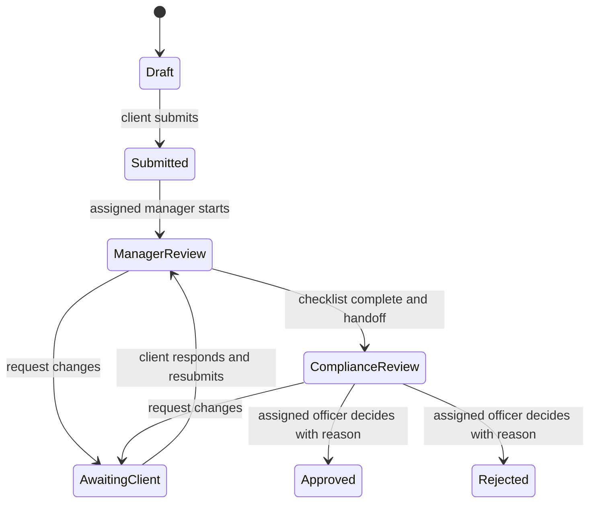

# POC demo contract — Phase 1

This is the implementation reference for the seven POC phases. Data is fictional. The Phase 1 interface illustrates future records and states; it does not execute their workflow.

## Scenario and actors

One fictional bank, Northstar Demo Bank, reviews contract/invoice packages for corporate cross-border payments. Approval concerns the document review only. No payment is executed.

The default client is Northstar Demo Ltd. A second fictional client, Cedar Demo Ltd, is reserved for Phase 2/3 isolation checks. Fictional staff are Alex Morgan (manager) and Jamie Taylor (compliance officer). The planned demo administrator manages synthetic setup/reset and does not automatically receive review authority.

| Action | Client | Assigned manager | Assigned compliance officer | Demo administrator |
| --- | --- | --- | --- | --- |
| View cases/documents | Own organization | Assigned client cases | Assigned review cases | No automatic business access |
| Create/upload | Own Draft/AwaitingClient case | No | No | Seed fixtures through a separate administrative path |
| Submit/resubmit | Own case | No | No | No |
| Formal checklist / handoff | No | Yes | No | No |
| Request client changes | Respond only | Yes, during manager review | Yes, during compliance review | No |
| Internal notes | Never visible | Assigned case | Assigned case | No automatic access |
| Approve/reject | No | No | Yes, with a reason | No |
| Reset demo | No | No | No | Named demo environment only |

This matrix is a requirements contract, not implemented authorization. Phase 2 establishes identity/policy infrastructure; Phases 3–4 enforce it on resources and actions. Local navigation between layouts is not a permission check.

## Three reproducible examples

| ID | Package | Intentional condition | Walkthrough outcome |
| --- | --- | --- | --- |
| FX-2026-001 | Equipment contract + invoice v1; EUR 24,000.00 on both | Complete package | Submit → manager checklist → compliance approval with reason. |
| FX-2026-002 | Consulting invoice v1; EUR 8,500.00 | Contract missing | Manager requests contract → client supplies it → resubmits → manager rechecks → compliance decides. |
| FX-2026-003 | Software contract EUR 12,000.00; invoice v1 EUR 12,500.00 | Amount mismatch | Compliance requests correction → client supplies invoice v2 EUR 12,000.00 → manager rechecks → compliance decides. |

The interface starts these examples at illustrative stages so all layouts can be inspected. No historical action is claimed to have occurred. Actual PDF/image fixtures, content hashes and stored version IDs are Phase 3 work. Phase 5 extraction/AI outputs remain explicitly simulated.

## State contract

- Submission requires case fields and at least one permitted document; a missing contract does not prevent submission. Package completeness is checked by the manager.
- Uploads occur in Draft or AwaitingClient. Resubmission always repeats manager review and preserves the open compliance request and assignment.
- A new document version invalidates the affected checklist confirmation. Final decisions reference exact reviewed versions and require reasons.
- Approved/Rejected cases are terminal and read-only in this POC. Reopening/archiving are outside its scope.
- Case state, document-processing state and analysis-job state remain separate. Model output cannot change a case decision.
- Commands will check role, organization, assignment, current state and revision on the server. Audit and state changes must commit atomically; retries must not duplicate an action.

## Planned data contract

| Entity | Required fields/invariants |
| --- | --- |
| Membership | Validated identity subject, bank, organization or staff assignment, explicit role; no client-supplied role authority. |
| Case | ID, bank, organization, title, status, revision, assigned manager/officer and UTC created/updated timestamps. |
| Document version | Stable document ID, version ID/number, case/bank/organization scope, generated object key, SHA-256, byte size, media type and uploader/time. |
| Checklist | Case and document snapshot, rule/checklist version, results, reviewer and time. |
| Message/request | Case scope, author/time, explicit internal/client visibility and request-resolution state. |
| Decision | Case revision, reviewed version IDs, authorized officer, approve/reject, reason and time. |
| Audit | Actor, action, scope, resource/version, UTC time and request correlation; separate staff/client projections. |
| Analysis | Job/version ID, queued/processing/completed/failed state, provider version, source-linked findings and simulated marker. |

Only Case/DocumentVersion type outlines and the health response type are introduced in Phase 1; storage schemas arrive with their features. Monetary comparisons use decimal-safe values with explicit currency, not floating-point arithmetic. The current preview uses display strings and performs no financial calculation.

## Screens and Phase 1 inspection

All layouts share the sidebar, synthetic-data banner and case outlines. The client sees a document workspace, the manager a client-case workspace, and compliance a review workspace. Search filters fictional examples only. The review-process page explains the correction loop and the guide states what is not implemented.

Open each role, search for `FX-2026-003`, open its outline, refresh the nested URL and inspect the corrected-invoice expectation. Open the process page and verify the return from AwaitingClient to ManagerReview. No submit/upload/approve action is active.
