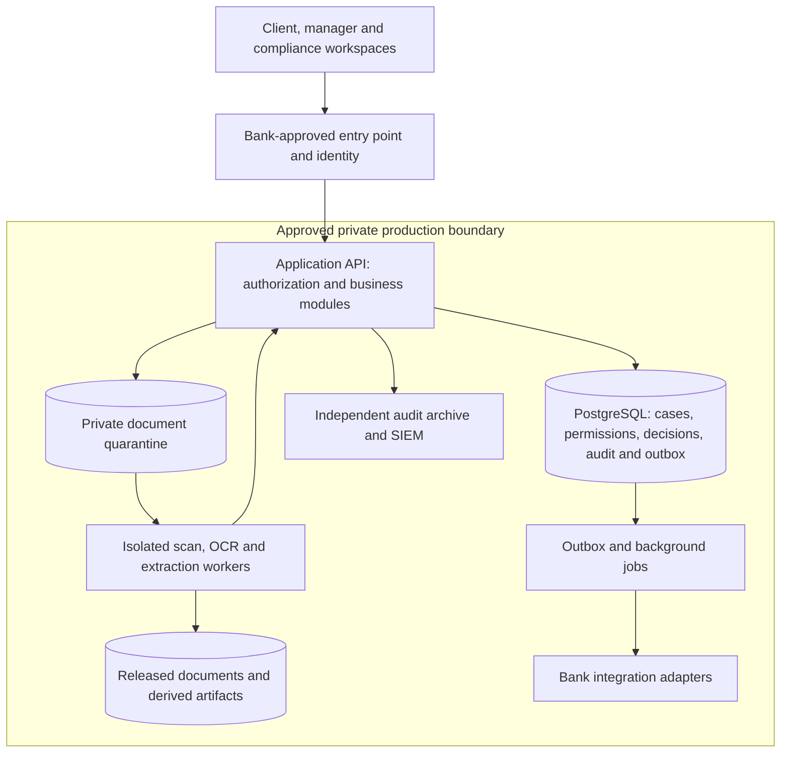
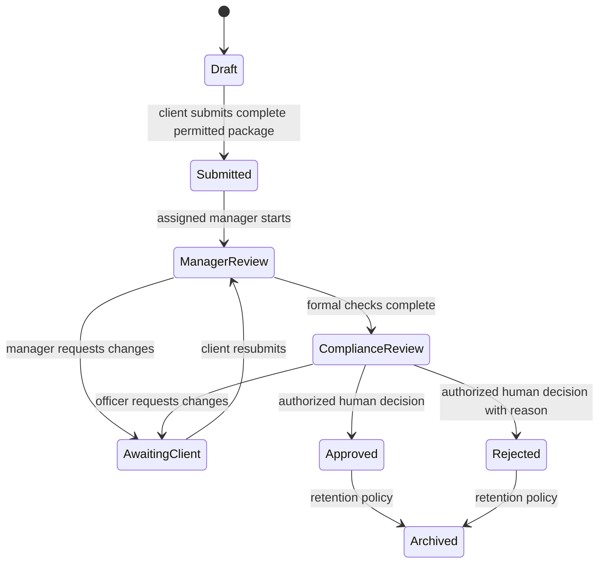

# Digital Compliance Hub — production implementation plan

Draft for discussion · 28 September 2026 · Production planning only. The local POC foundation is implemented; further progress is tracked in the separate POC plan. No production application has been deployed.

## 1. Recommendation and assumptions

Build a document-review and case-management product with three role-specific workspaces, a shared transactional core, and an isolated document-processing service. Start with a modular monolith: one business application organized into clear modules, rather than turning every box in the supplied diagram into a separately deployed service.

Use portable TypeScript for the web application and API, Node.js for the production runtime, PostgreSQL for production records, private object storage for documents, and the bank's identity provider. Reserve Python for isolated OCR/AI processing. Deploy production inside a bank-approved private environment. Use Cloudflare for the separate, synthetic-data customer demonstration described in [the POC plan](cloudflare-poc-plan.md).

Confirmed scope and working assumptions:

- Initial users are corporate clients, relationship managers, and compliance/currency-control officers. This is document review, not payment execution or autonomous regulatory decision-making.
- Confirmed: target both Ukraine and the EU/EEA. Share the product codebase while maintaining separate bank/market policy packs and deployment approvals.
- One isolated production deployment per bank initially. Each bank serves multiple corporate organizations; organization-level authorization remains necessary.
- The on-premises AI box represents a private-processing requirement for production. The first POC simulates its outputs.
- Confirmed: POC data consists only of fictional organizations and supplied synthetic documents. A real-data pilot is a later release gate.
- Confirmed: prefer JavaScript/TypeScript and Node.js, with Python where needed; security is the first priority. No bank-mandated hosting model, identity platform, volume, retention period, or availability target is known yet. Those constraints must be decided in Phase 0.

The supplied image is a product reference, not an instruction to operate systems. Its treasury, trading, live FX, automatic deal execution, and core banking integrations remain outside the initial scope. At the planning baseline, the workspace had no application source or Git repository; the POC is a new implementation.

## 2. Technology decisions

These are recommendations for this project's constraints, not a claim that one stack is universally best for banks. Prefer generally available releases with a support horizon, known operational ownership, and reproducible builds. Pin exact versions and container digests at implementation kickoff; apply security patches throughout development.

| Area | Recommended production baseline | Reason and boundary |
| --- | --- | --- |
| Frontend | React, TypeScript in strict mode, Vite; one shared component library | Three workspaces share case, document, and timeline components. A browser SPA is sufficient for this authenticated application. |
| API | Hono + TypeScript on Node.js 24 LTS in Linux containers; Zod validation and an OpenAPI contract | Reuses most application logic from Cloudflare. Keep Cloudflare bindings out of domain modules. Hono supports Workers and Node.js; Node 24 is currently LTS. Hono itself has a different maintenance policy from Node. [Hono](https://hono.dev/docs/), [Node release schedule](https://github.com/nodejs/Release) |
| Database | PostgreSQL 18, latest supported minor; SQL migrations and parameterized repository queries | Transactions, constraints, reporting, recovery, and row-level security. PostgreSQL supports major versions for five years. Use a bank-approved supported version if its platform has not certified 18. [Version policy](https://www.postgresql.org/support/versioning/) |
| Documents | Bank-approved S3-compatible object storage; separate quarantine and released areas | Documents remain outside the relational database. Require encryption, version preservation, lifecycle controls, and verified retention/immutability capabilities. S3 compatibility alone does not guarantee every security feature. |
| Identity | Existing bank OIDC identity provider; separate workforce and customer policies | Reuse established identity lifecycle, MFA, revocation, and account recovery. A self-hosted identity service is a fallback only if the bank lacks an appropriate provider. |
| Workflow | Explicit state machine + versioned checklists + transactional outbox | Review steps stay inspectable and testable. A background worker processes durable jobs. Add a dedicated workflow engine only when timers, integrations, and operations justify it. |
| Document processing | Isolated Python service; Docling with a benchmarked OCR backend | Extract text/layout inside the approved boundary. Docling supports prefetched models and offline execution. [Offline configuration](https://docling-project.github.io/docling/usage/advanced_options/) |
| Optional language model | Private inference service, potentially vLLM, with a separately evaluated model | Select weights by Ukrainian/English document performance, license, GPU requirements, latency, and evidence quality. Structured JSON does not establish factual correctness. [vLLM structured outputs](https://docs.vllm.ai/en/stable/examples/features/structured_outputs/) |
| Operations | Bank container platform, infrastructure as code, OpenTelemetry-compatible monitoring, bank SIEM | Reuse the bank's runtime and operating model. Introduce Kubernetes only if the bank already operates it or measured needs justify it. |
| Verification | Vitest for policy/workflow tests, Playwright for user journeys; dependency, secret, container and API security checks in CI | Prioritize authorization, document access, transition integrity, recovery, and integration failures over superficial coverage numbers. |

**Stack decision:** TypeScript and Node.js remain the default through production. Security depends on explicit authorization, runtime input validation, safe queries, isolation, secure dependencies, and verified operations. TypeScript's compile-time types do not validate HTTP input, identity claims, extracted document fields, or model outputs. Validate those boundaries at runtime and keep CPU-intensive document work outside API request handlers. Confirm the bank can operate and support this stack during discovery.

**Database decision:** PostgreSQL is the production source of truth because this product needs relational permissions, document/version references, consistent review transitions and reporting. Documents belong in object storage. Start without Redis, a vector database or a second operational database; introduce another store only for a measured requirement. PostgreSQL access remains behind the API, using least-privilege service identities and separate migration credentials. D1 is the deliberately smaller POC adapter.

For document AI, benchmark the private open-source pipeline against a commercial document-processing product when support or extraction quality warrants it. Azure Document Intelligence has disconnected container options, but supported models, access approval, and commitment pricing must be checked; it is not a drop-in free offline service. Select through a representative document benchmark rather than marketing accuracy figures. [Microsoft container requirements](https://learn.microsoft.com/en-us/azure/ai-services/document-intelligence/containers/disconnected)

If the bank already owns a suitable case-management/BPM or DMS platform, compare extending it against this build in Phase 0. Build the distinctive customer/reviewer experience and domain rules; reuse identity, storage, scanning, logging, and existing document infrastructure where practical.

## 3. Architecture and responsibility boundaries

The entry point is deployed according to the approved data-flow design; the diagram does not assume that sensitive traffic may be decrypted by an external CDN.

| Diagram component | Initial implementation |
| --- | --- |
| Client workspace | Create cases, upload versions, see permitted status/history, respond to change requests. |
| Manager workspace | Assigned-client queue, formal completeness checklist, client communication, handoff to compliance. |
| Compliance workspace | Evidence review, findings, internal notes, explicit client-facing requests, reasoned decision. |
| Document Workflow | Upload lifecycle, immutable versions, document status, case routing and checklist definitions. |
| Compliance Hub | Versioned deterministic rules, tasks, decisions and escalation policy. |
| On-prem AI | Asynchronous extraction and suggestions; no authority to change compliance decisions or contact customers. |
| Data layer | Relational source of truth, object references, permissions, events and integration contracts. |
| Statistics | Permission-filtered counts and timings from operational data initially. Add a reporting replica/warehouse when workload requires it. |
| Security and audit | Controls enforced across all modules, with independent audit export and recovery procedures. |

Deploy the API and background document workers separately because file parsers, OCR, and models have different security and resource requirements. Other module boundaries initially remain in code.

## 4. Domain model and workflow

Core records: bank, organization, user membership, case, assignment, document, document version, checklist/version, checklist response, analysis run, finding, change request, message, decision, audit event, outbox event, and notification delivery.

Every relevant record carries bank and organization scope. Document versions store a server-generated object key, checksum, media type, size, uploader, time, and scan state. Analysis and decisions refer to exact document versions and rule/model versions. Monetary values use decimal-safe representations and explicit currencies; never floating-point arithmetic for financial comparisons.

Policy packs carry jurisdiction, bank owner, version, effective dates, checklist rules and approved source references. New rules require review and recorded activation; they must not silently change the basis of an earlier decision. Localize user-facing strings for Ukrainian and English from the beginning, with additional EU languages selected by customer demand. Country-specific rules are never inferred from interface language.

Proposed case flow:

For the first workflow, resubmissions always repeat manager review. Preserve the outstanding compliance request so it returns to the correct officer. Later shortcuts require an explicit policy decision.

Case state, document scan state, document review state, and AI processing state are separate. An approved case means the document review was approved; it does not mean a payment was made. Once finalized, preserve the reviewed snapshot. Reopening requires an authorized, audited action and a new review revision.

Use named server commands such as submit, request changes, hand off, and decide. Do not expose unrestricted status editing. Each transition checks authorization, current revision, prerequisites, and allowed next state. Commit the state change, decision/audit record, and outbox entry atomically. Use idempotency keys and optimistic concurrency to prevent duplicated or conflicting decisions. Object storage and the database require a staged upload/finalization protocol and orphan reconciliation; they do not share one transaction.

## 5. Controls required before real customer data

Use an OWASP ASVS 5.0 requirements matrix, targeting Level 2 as the baseline and evaluating relevant Level 3 controls with the bank's security team. Record applicability and evidence rather than claiming certification from a checklist. [OWASP ASVS](https://owasp.org/projects/asvs)

| Risk | Required design and evidence |
| --- | --- |
| Access to another client's information | Deny-by-default server authorization using bank, organization, assignment, role, and resource. Test lists, individual records, files, search, exports, statistics, and background jobs. Use PostgreSQL RLS as additional protection with a non-owner application role and transaction-scoped tenant context. Table owners and privileged roles can bypass RLS. [PostgreSQL policies](https://www.postgresql.org/docs/current/ddl-rowsecurity.html) |
| Excessive staff privileges | Staff MFA, short sessions and revocation, least privilege, separate business and infrastructure administration. Require different maker/checker identities where policy mandates it; emergency access is time-limited and reviewed. |
| Leaked internal comments | Explicit internal/client-visible message type; separate response schemas and notification templates. Internal findings and audit records never reach client payloads by accident. |
| Malicious uploads | Quarantine first; limits on type, bytes, pages and decompression; file-signature checks; malware scanning; sandboxed parsing; content disarm where required. Block encrypted/uninspectable files according to policy. No external URL fetching or public scanning service receiving bank documents. [OWASP upload guidance](https://cheatsheetseries.owasp.org/cheatsheets/File_Upload_Cheat_Sheet.html) |
| Document disclosure | Private buckets, per-request file authorization, bounded download access, no public object links, sensitive responses marked no-store, no browser offline caching of documents. Protect preview surfaces with CSP and isolation. |
| Key or secret compromise | TLS, encrypted storage/backups, bank-approved KMS/HSM arrangements, rotation and recovery procedures, scoped service credentials. Verify who can decrypt documents and who can change keys. |
| Audit tampering | Record actor, action, resource/version, UTC time, request ID, decision reason and relevant state changes. Capture views/downloads as well as writes. Export through a reliable outbox to independently controlled append-only/retention-locked storage. A database table or hash chain alone is not immutable evidence. |
| Sensitive telemetry | Operational logs exclude document bodies, OCR text, prompts, tokens, and unnecessary personal data. Security/audit evidence has restricted access and a defined retention policy. |
| Lost work or duplicate processing | Durable jobs, bounded retries, idempotent consumers, dead-letter handling, alerts and reconciliation. A document-processing outage leaves the case in a visible pending/failed state and permits controlled manual review. |
| Outage or accidental deletion | Encrypted backups, point-in-time database recovery, versioned object recovery, independent recovery access, and restore drills that reconcile database records with document versions. Define and test RPO/RTO with the bank. |
| Supply-chain compromise | Locked dependencies, SBOM, image signing, vulnerability handling, scoped deployment credentials, protected environments and separation between development and production. |

Retention, deletion, legal hold, exports and backup expiry must be one policy spanning originals, extracted text, findings, logs, and models' temporary files. Do not invent a universal retention period.

## 6. AI: useful assistance with measurable boundaries

Processing sequence: upload → quarantine → scan → release → OCR/layout extraction → typed field extraction → deterministic checks → optional summary/draft request → human review.

Every extracted field should carry document/version ID, page and source span or bounding box, extraction method, and review state. Show uncertainty and allow correction. Confidence scores require calibration; a model's self-reported confidence is not a reliable approval signal.

Treat document text as untrusted content. It may contain instructions, links, or misleading statements. It cannot modify system instructions, authorize tools, trigger external network calls, or change case decisions. Keep model workers without bank transaction credentials and restrict network egress. Suggestions become client communications only after staff approval.

Before selecting models, assemble an authorized, representative evaluation set across Ukrainian/English text, scans, stamps, tables, poor images, and known discrepancies. Measure field-level correctness, missed discrepancies, false alerts, reviewer correction time, latency, and operating cost. Set acceptance thresholds with domain owners before evaluating. Keep final decisions with humans even when extraction improves.

For the base POC, use clearly labeled fixture outputs. A later private AI spike must benchmark real processing independently; successful fixture demonstrations do not validate OCR/model quality.

## 7. Phases and release gates

Durations are planning estimates, not delivery commitments. Production phases assume a small cross-functional team with bank product, security, and operations participation; procurement and access lead times are additional.

| Phase | Indicative effort | Deliverables | Exit evidence |
| --- | --- | --- | --- |
| 0 — Product and bank constraints | 1–2 weeks | One prioritized case type; role/action matrix; Ukraine and EU/EEA applicability matrices; data classification and flow; hosting decision; threats; volumes; retention; integration inventory; buy/build decision. | Named bank owners accept the scope and measurable success criteria. Stack and unresolved risks are recorded. |
| 1 — Customer-demo POC | 2–4 weeks, one experienced full-stack engineer | Cloudflare demo covering client → manager → compliance → client correction → decision; synthetic documents; simulated AI. | POC checks pass and a potential customer completes the scenario with recorded feedback. |
| 2 — Production foundations | 3–5 weeks | Private deployment, bank SSO, PostgreSQL, storage/KMS, scope enforcement, transactional transitions, durable jobs and CI/CD. | Deployment is repeatable; cross-organization tests, concurrency tests and restore rehearsal pass. |
| 3 — Controlled workflow release | 4–6 weeks | Real upload quarantine/scanning, checklists, versioning, comments, audit archive, retention, operational dashboards, accessible UI and export controls. | Security review and agreed ASVS checks pass; evidence shows every decision is reconstructable. |
| 4 — Private AI and first integrations | 3–5 weeks | Representative OCR/model benchmark, evidence-linked extraction, manual fallback; one approved DMS/CRM or notification adapter. | Accuracy/latency targets agreed in Phase 0 are met; outages and duplicate delivery are handled safely. AI may remain disabled if it misses its gate. |
| 5 — Restricted bank pilot | 4–8 weeks | Limited users and approved real data, independent penetration test, incident/restore exercises, support runbooks, retention and exit procedures. | Bank owners accept residual risk; pilot business metrics and operational targets are demonstrated. |
| 6 — Broader rollout | After pilot evidence | Capacity tuning, stronger automation, more integrations and reporting; split services only where justified. | Rollout criteria and rollback procedures are met for each expansion. |

Measure case turnaround time, staff handling time, rework rounds, overdue tasks, extraction correction rate, and completeness of audit evidence. Establish a manual-process baseline before claiming savings. During Phase 0, set volumes in cases/day, documents/case, pages/document, peak concurrent reviewers and expected document-processing latency; load tests must include these dimensions.

Suggested discussion starting points for a pilot are 99.9% monthly availability, RPO ≤15 minutes and RTO ≤4 hours. These are proposed targets, not product guarantees or regulatory minima, and must include identity, storage, jobs, and integrations.

## 8. Jurisdiction and Cloudflare boundary

For Ukraine, the bank should map applicable banking secrecy, information-security, outsourcing/cloud, and retention requirements. NBU Resolution No. 99 of 25 August 2025 is a relevant cloud-services source; verify the consolidated rules and applicability with the bank before real-data deployment. This plan does not determine legal compliance. [Official consolidated text](https://zakon.rada.gov.ua/laws/show/v0099500-25)

For an EU/EEA deployment, assess GDPR and DORA applicability, including local implementation where relevant, ICT supplier contracts, incident handling, testing, subcontractors, and exit arrangements. DORA has applied in the EU since 17 January 2025. Do not assume those obligations are fulfilled by selecting a certified vendor. [European Commission](https://finance.ec.europa.eu/news/digital-finance-2024-12-19_en)

Document controller/processor responsibilities, lawful purposes, access/deletion procedures, security measures, DPIA applicability, and any international transfers. EU hosting alone does not complete GDPR compliance; approved data flows include support access and subprocessors. [GDPR text](https://eur-lex.europa.eu/eli/reg/2016/679/oj/?pid=14006577)

Assess AI Act applicability against the intended use and provider/deployer roles before enabling real AI. Do not automatically classify every banking document assistant as high risk, or assume human review removes applicable obligations. Expansion into creditworthiness or other regulated decision support needs a fresh assessment. [Commission AI Act guidance](https://digital-strategy.ec.europa.eu/en/faqs/navigating-ai-act)

Keep Ukraine and EU/EEA deployments, keys and operational data separated by default. Use a shared codebase with approved market configuration, not a shared cross-border document pool. Cross-market replication, support access and analytics require their own approved data-flow design.

Cloudflare D1 and R2 offer EU jurisdiction controls, but those controls do not establish where the complete application processes data. Workers regional execution, background triggers, Access, logging, support access, backups and third-party services must be assessed separately. Cloudflare documents that Workers code/secrets are globally distributed and that Regional Services does not apply to Queue or Cron triggers. Therefore the low-cost demo configuration is not the proposed real-data bank environment. [D1 locality](https://developers.cloudflare.com/d1/configuration/data-location/), [R2 locality](https://developers.cloudflare.com/r2/reference/data-location/), [Workers localization limits](https://developers.cloudflare.com/data-localization/how-to/workers/)

## 9. Decisions to settle together

1. First pilot bank in each target market and its hosting/support constraints for the chosen Node.js/TypeScript stack.
2. First case type and exact document/checklist requirements; who owns and approves each rule.
3. Real-data pilot entry criteria after the confirmed synthetic-only POC.
4. Required languages, document quality, daily volume and reviewer concurrency.
5. Whether customers primarily buy workflow transparency, reduced manual checking, or integration into their existing bank systems.

The recommended next implementation scope is Phase 1 only, using the narrower POC checklist. Production foundations follow customer validation and bank constraints.
